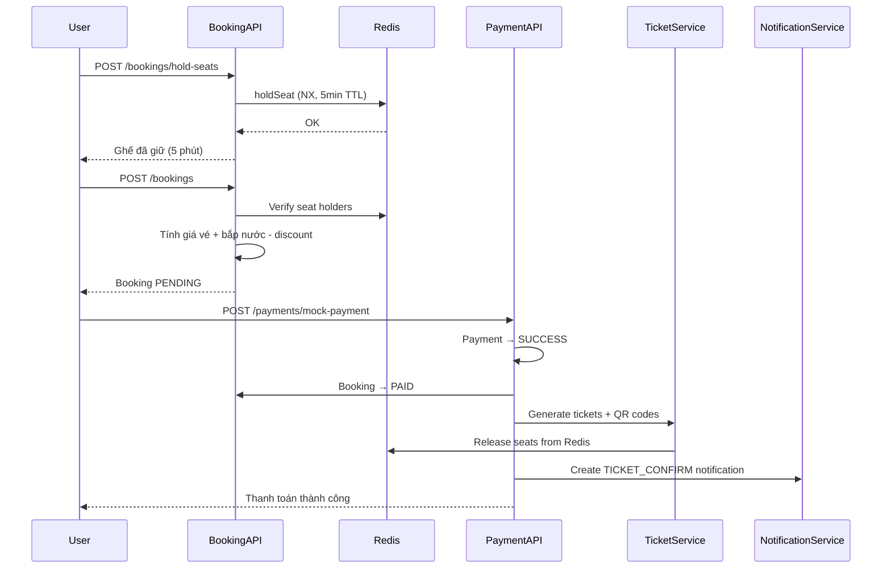

# 🎬 Cinema Management API - Tài liệu API

> Build thành công ✅ — Tất cả 5 phases đã được triển khai hoàn tất.

## Tổng quan

| Module | Files Created | APIs |
|--------|--------------|------|
| **Cinema** | 5 files (3 DTOs, 1 Service, 1 Controller) | 10 endpoints |
| **Users** | 3 files (1 DTO, 1 Service, 1 Controller) | 3 endpoints |
| **Concession** | 3 files (1 DTO, 1 Service, 1 Controller) | 5 endpoints |
| **Promotion** | 3 files (1 DTO, 1 Service, 1 Controller) | 6 endpoints |
| **Showtime** | 3 files (1 DTO, 1 Service, 1 Controller) | 7 endpoints |
| **Ticket** | 3 files (1 DTO, 1 Service, 1 Controller) | 5 endpoints |
| **Booking** | 3 files (1 DTO, 1 Service, 1 Controller) | 4 endpoints |
| **Payment** | 3 files (1 DTO, 1 Service, 1 Controller) | 1 endpoint |
| **Notification** | 2 files (1 Service, 1 Controller) | 1 endpoint |
| **Total** | **29 files** | **42 endpoints** |

---

## Phase 1: Cinema Module (Rạp / Phòng / Ghế)

### 🏢 Cinema CRUD
| Method | Endpoint | Auth | Mô tả |
|--------|---------|------|--------|
| `POST` | `/cinemas` | Admin/Staff | Tạo rạp chiếu phim |
| `GET` | `/cinemas?page=1&pageSize=10` | Public | Lấy danh sách rạp (phân trang) |
| `GET` | `/cinemas/:id` | Public | Lấy chi tiết rạp + danh sách phòng |
| `PUT` | `/cinemas/:id` | Admin/Staff | Cập nhật thông tin rạp |
| `DELETE` | `/cinemas/:id` | Admin/Staff | Xóa rạp |

### 🚪 Room CRUD
| Method | Endpoint | Auth | Mô tả |
|--------|---------|------|--------|
| `POST` | `/cinemas/:cinemaId/rooms` | Admin/Staff | Tạo phòng chiếu |
| `GET` | `/cinemas/:cinemaId/rooms` | Public | Lấy DS phòng theo rạp |
| `GET` | `/cinemas/rooms/:roomId` | Public | Chi tiết phòng + ghế |
| `PUT` | `/cinemas/rooms/:roomId` | Admin/Staff | Cập nhật phòng |
| `DELETE` | `/cinemas/rooms/:roomId` | Admin/Staff | Xóa phòng |

### 💺 Seat
| Method | Endpoint | Auth | Mô tả |
|--------|---------|------|--------|
| `POST` | `/cinemas/rooms/:roomId/generate-seats` | Admin/Staff | Tạo ghế tự động (rows, columns, seatType) |
| `GET` | `/cinemas/rooms/:roomId/seats` | Public | Lấy DS ghế theo phòng |

---

## Phase 2: Users / Concession / Promotion

### 👤 Users
| Method | Endpoint | Auth | Mô tả |
|--------|---------|------|--------|
| `GET` | `/users?page=1&pageSize=10` | Admin/Staff | Danh sách user (phân trang) |
| `GET` | `/users/profile` | Authenticated | Lấy profile user đang đăng nhập |
| `PUT` | `/users/:id/status` | Admin/Staff | Khóa/mở khóa tài khoản |

### 🍿 Concession
| Method | Endpoint | Auth | Mô tả |
|--------|---------|------|--------|
| `POST` | `/concessions` | Admin/Staff | Tạo sản phẩm bắp nước |
| `GET` | `/concessions?page=1&pageSize=10` | Public | Danh sách sản phẩm |
| `GET` | `/concessions/:id` | Public | Chi tiết sản phẩm |
| `PUT` | `/concessions/:id` | Admin/Staff | Cập nhật sản phẩm |
| `DELETE` | `/concessions/:id` | Admin/Staff | Xóa sản phẩm |

### 🎁 Promotion
| Method | Endpoint | Auth | Mô tả |
|--------|---------|------|--------|
| `POST` | `/promotions` | Admin/Staff | Tạo khuyến mãi |
| `GET` | `/promotions?page=1&pageSize=10` | Admin/Staff | Danh sách khuyến mãi |
| `GET` | `/promotions/:id` | Admin/Staff | Chi tiết khuyến mãi |
| `PUT` | `/promotions/:id` | Admin/Staff | Cập nhật khuyến mãi |
| `DELETE` | `/promotions/:id` | Admin/Staff | Xóa khuyến mãi |
| `POST` | `/promotions/check-promotion` | Authenticated | Kiểm tra mã khuyến mãi (code, movieId) |

---

## Phase 3: Showtime & Ticket Price

### 🎬 Showtime
| Method | Endpoint | Auth | Mô tả |
|--------|---------|------|--------|
| `POST` | `/showtimes` | Admin/Staff | Tạo suất chiếu (có check trùng lịch) |
| `GET` | `/showtimes?page=1&pageSize=10` | Public | Danh sách suất chiếu |
| `GET` | `/showtimes/:id` | Public | Chi tiết suất chiếu |
| `GET` | `/showtimes/by-movie/:movieId` | Public | Suất chiếu theo phim (nhóm theo ngày) |
| `GET` | `/showtimes/by-cinema/:cinemaId` | Public | Suất chiếu theo rạp (nhóm theo ngày) |
| `PUT` | `/showtimes/:id` | Admin/Staff | Cập nhật suất chiếu |
| `DELETE` | `/showtimes/:id` | Admin/Staff | Xóa suất chiếu |

### 💰 Ticket Price
| Method | Endpoint | Auth | Mô tả |
|--------|---------|------|--------|
| `POST` | `/tickets/prices` | Admin/Staff | Tạo giá vé (showtimeId, seatType, dayType) |
| `POST` | `/tickets/prices/bulk` | Admin/Staff | Cấu hình giá vé hàng loạt |
| `GET` | `/tickets/prices/showtime/:showtimeId` | Public | Lấy DS giá vé theo suất chiếu |
| `PUT` | `/tickets/prices/:id` | Admin/Staff | Cập nhật giá vé |
| `DELETE` | `/tickets/prices/:id` | Admin/Staff | Xóa giá vé |

---

## Phase 4: Booking (Seat Hold + Đặt vé)

### 🎟️ Booking
| Method | Endpoint | Auth | Mô tả |
|--------|---------|------|--------|
| `POST` | `/bookings/hold-seats` | Authenticated | Giữ ghế 5 phút (Redis + DB log) |
| `POST` | `/bookings` | Authenticated | Tạo đơn đặt vé (ghế + bắp nước + promotion) |
| `GET` | `/bookings/showtime/:showtimeId/seats` | Public | DS ghế đã đặt/giữ cho suất chiếu |
| `GET` | `/bookings/my-bookings?page=1&pageSize=10` | Authenticated | Lịch sử đặt vé của user |

---

## Phase 5: Payment / Ticket / Notification

### 💳 Payment
| Method | Endpoint | Auth | Mô tả |
|--------|---------|------|--------|
| `POST` | `/payments/mock-payment` | Authenticated | Mock thanh toán → PAID → Generate tickets → Notification |

### 🔔 Notification
| Method | Endpoint | Auth | Mô tả |
|--------|---------|------|--------|
| `GET` | `/notifications?page=1&pageSize=10` | Authenticated | Danh sách thông báo của user |

---

## Luồng đặt vé hoàn chỉnh

---

## Files đã tạo/sửa

### Tạo mới (29 files)
- `src/module/cinema/dto/cinema.dto.ts`, `room.dto.ts`, `seat.dto.ts`
- `src/module/cinema/cinema.service.ts`, `cinema.controller.ts`
- `src/module/users/dto/users.dto.ts`
- `src/module/users/users.service.ts`, `users.controller.ts`
- `src/module/concession/dto/concession.dto.ts`
- `src/module/concession/concession.service.ts`, `concession.controller.ts`
- `src/module/promotion/dto/promotion.dto.ts`
- `src/module/promotion/promotion.service.ts`, `promotion.controller.ts`
- `src/module/showtime/dto/showtime.dto.ts`
- `src/module/showtime/showtime.service.ts`, `showtime.controller.ts`
- `src/module/ticket/dto/ticket-price.dto.ts`
- `src/module/ticket/ticket.service.ts`, `ticket.controller.ts`
- `src/module/booking/dto/booking.dto.ts`
- `src/module/booking/booking.service.ts`, `booking.controller.ts`
- `src/module/payment/dto/payment.dto.ts`
- `src/module/payment/payment.service.ts`, `payment.controller.ts`
- `src/module/notification/notification.service.ts`, `notification.controller.ts`

### Cập nhật (8 module files)
- `cinema.module.ts`, `users.module.ts`, `concession.module.ts`
- `promotion.module.ts`, `showtime.module.ts`, `ticket.module.ts`
- `booking.module.ts`, `payment.module.ts`, `notification.module.ts`

> [!IMPORTANT]
> Không có entity nào bị sửa đổi. Tất cả entity giữ nguyên như ban đầu.
